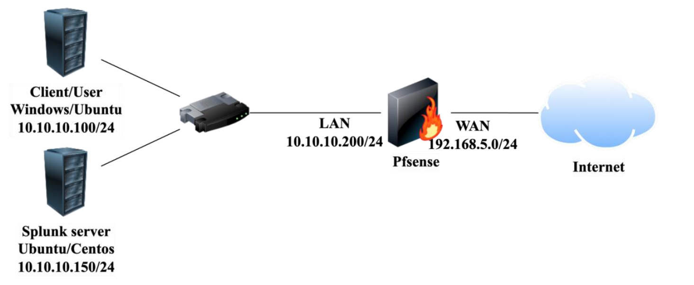

# This is a simple deployment of Splunk with a pfSense Firewall
## Overview
The Security Information and Event Management (SIEM) system is a solution, tool to collect, analyze, and manage information and events related to information security from various sources within a network or system.
## Proposed scheme

